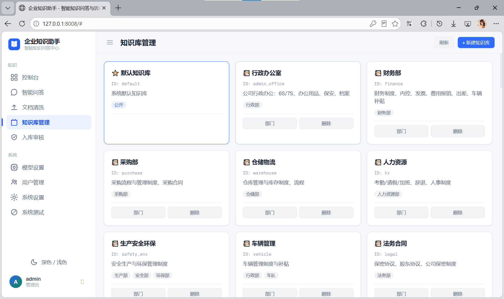
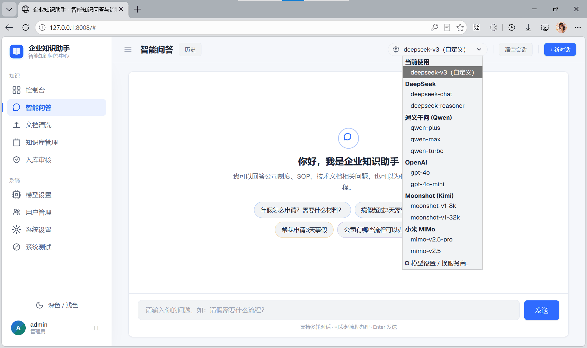
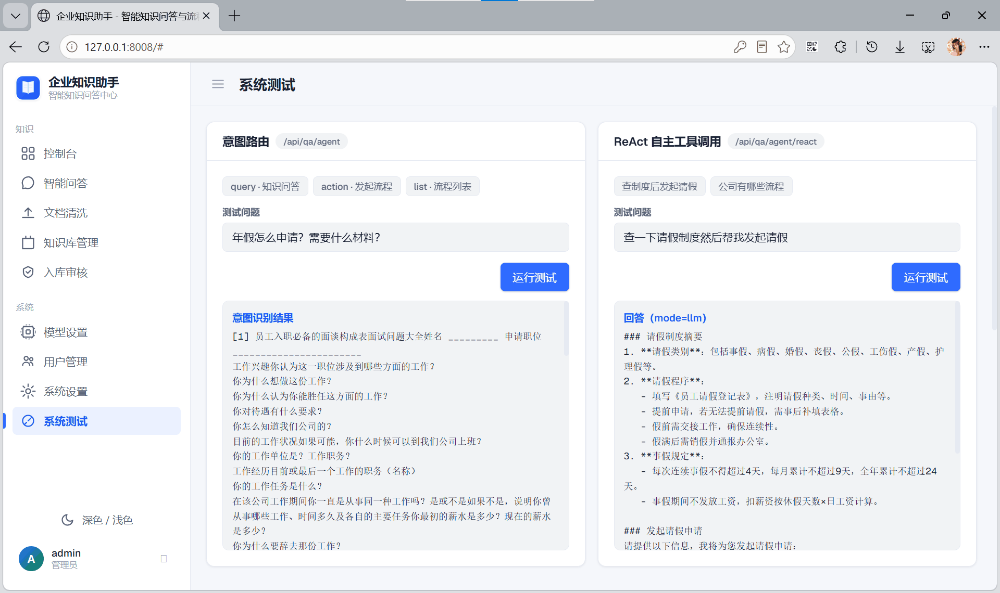
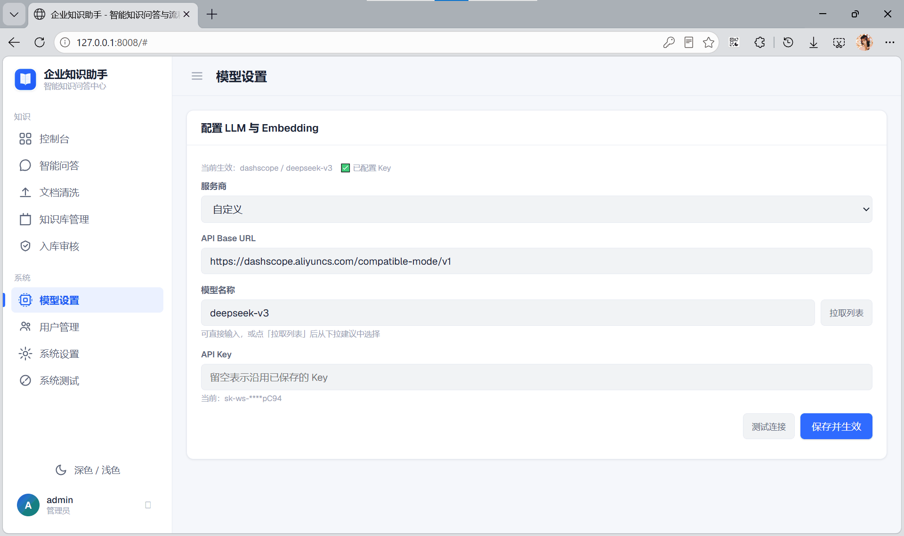
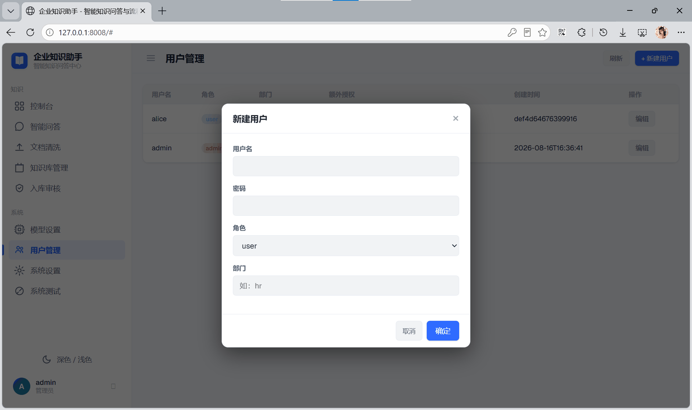
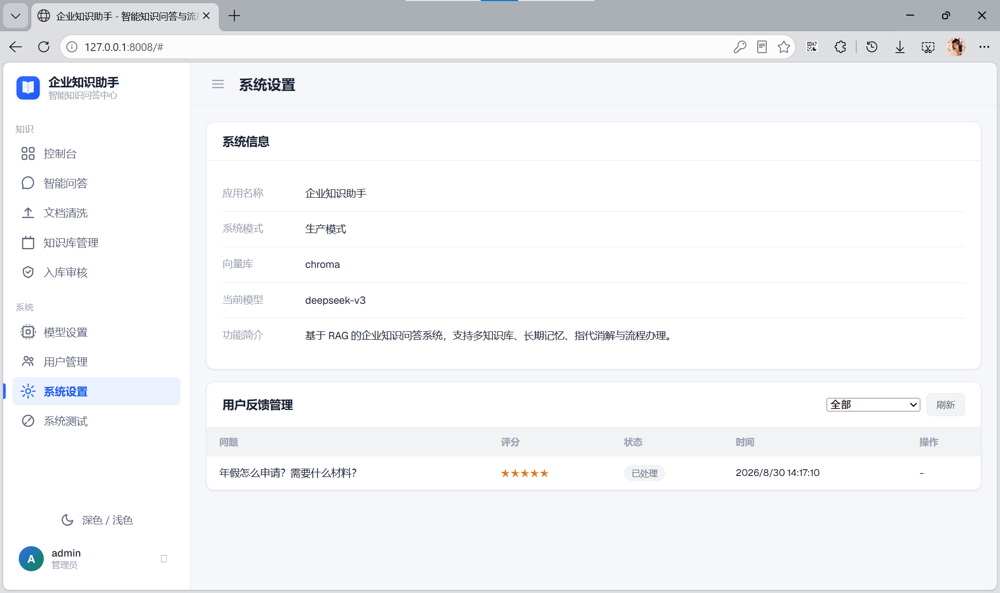

# 企业知识助手

将 SOP、技术文档转化为可查询的知识库，员工提问即可秒级获取标准答案。2.0 升级为可观测、可评估、可扩展的多知识库 RAG 平台；3.0 新增入库审核流（AI 预筛打分 + 人工把关）；4.0 完成 UI「科技蓝」改版（默认浅色主题，P1 已合入）。

> 📌 **完整项目文档**（背景/架构/进度/踩坑/数据口径）见 [`docs/项目文档.md`](docs/项目文档.md)。
> 📌 **开发手册**（全程关键节点开发日志，11 篇）见 [`docs/开发手册/`](docs/开发手册/README.md)。
> 📌 **版本变更**见 [`CHANGELOG.md`](CHANGELOG.md)。

## 界面预览

<table>
  <tr>
    <td width="50%"><br><sub><b>控制台</b> — 202 文档 / 2086 分片 / Token 用量与缓存命中</sub></td>
    <td width="50%"><br><sub><b>智能问答</b> — 引用溯源（点击查看原文）+ 阶段耗时 3.9s</sub></td>
  </tr>
  <tr>
    <td><br><sub><b>知识库管理</b> — 8 部门库 + 默认库，按部门授权</sub></td>
    <td><br><sub><b>模型热切换</b> — DeepSeek / Qwen / GPT / Kimi / MiMo 分组，会话内直接切换</sub></td>
  </tr>
  <tr>
    <td><br><sub><b>系统测试</b> — 意图路由与 ReAct 工具调用轨迹可视化</sub></td>
    <td><br><sub><b>模型设置</b> — LLM 与 Embedding 运行时配置，保存即生效</sub></td>
  </tr>
  <tr>
    <td><br><sub><b>用户管理</b> — JWT 认证 + 部门白名单三级权限</sub></td>
    <td><br><sub><b>系统设置</b> — 系统运行信息与用户反馈管理</sub></td>
  </tr>
</table>

<sub>入库审核工作台（前端 P2 规划中）等其余页面截图见 [`docs/screenshots/`](docs/screenshots/)。</sub>

## 核心亮点

- **混合检索**：Dense 向量 + 全量 BM25 双路召回 → RRF 融合（K=60）→ 可插拔重排（Qwen / BGE / Demo 兜底）
- **流式问答**：SSE 全程阶段推送（理解问题 → 检索 → 生成），多轮追问端到端 **6.9s**（实测）
- **入库审核流**：四维规则打分（0-100）+ 审核状态机 + 双层存储，人工标注分片检索加权 ×1.2
- **多知识库 × RBAC**：8 部门 + default 共 9 库；JWT 认证 + 部门白名单三级权限
- **格式覆盖**：PDF / Word(.docx·.doc) / Excel(.xlsx) / MD / TXT；不支持的格式（.xls/.wps）入库时显式上报，不静默跳过
- **冷启动 2.4s**（实测，原 ~17s）；**75 个测试全离线通过**（无需 API Key / 向量库 / 本地模型）

## 技术栈

| 层级 | 选型 |
|------|------|
| 编排框架 | LangChain v0.3+ / LangGraph |
| Web 服务 | FastAPI |
| 向量数据库 | ChromaDB（开发）→ Milvus（生产） |
| LLM | 阿里云百炼 `deepseek-v3`（主，OpenAI 兼容，运行时热切换）/ 任意 OpenAI 兼容接口 |
| Embedding | 可插拔：DashScope text-embedding-v3 / 本地 BGE / Demo 兜底 |
| 重排序 | 可插拔：Qwen-Rerank / BGE 本地 / Demo 兜底 |
| 认证 | JWT + RBAC |
| 文档处理 | PyMuPDF / python-docx(.docx) / olefile(.doc) / zipfile(.xlsx) |

## 技术选型

**1. LangGraph 状态图编排**
意图分类 → 条件路由 → 知识 / 流程节点 → 记忆写入，全流程有状态、可观测、节点级异常兜底；注册查询 / 发起 / 列举三类工具，问答「查完即办」。

**2. 双路召回 + RRF 融合排序**
专业术语场景纯语义检索命中不稳：BM25 稀疏召回与向量语义召回互补，RRF（K=60）融合排序，兼顾关键词精确命中与语义泛化。

**3. Reranker 三档可插拔**
本地规则 / 在线模型 / BGE 本地三档精排，任一档失败自动回退，可用性优先；检索结果保留来源与相似度得分，答案可溯源。

**4. 多服务商 LLM 网关**
OpenAI 兼容接口统一封装，主模型运行时可热切换、业务代码零改动；无 API Key 场景自动切 DemoLLM 与规则引擎兜底，全链路离线可验证。

## 实现流程

**离线 · 知识入库链路**

| # | 阶段 | 说明 |
|:--|:--|:--|
| 1 | 多格式文档解析 | PDF / Word `.docx`·`.doc` / Excel `.xlsx` / MD / TXT；`.xls`·`.wps` 不支持时显式上报 |
| 2 | 两阶段清洗 | 基础去噪 + 结构清洗，切片前完成 |
| 3 | 中文语义切片 | 中文标点感知分段 |
| 4 | 向量化 | Embedding 批量调用 |
| 5 | 指纹增量入库 | `chunk_hash` 比对，未变分片复用，新 SOP 分钟级生效 |

**在线 · 问答服务链路**

| # | 阶段 | 说明 |
|:--|:--|:--|
| 1 | 用户提问 | `kb_id` 校验，多知识库权限隔离 |
| 2 | 意图分类与路由 | LangGraph StateGraph 条件路由 |
| 3 | 双路召回 | BM25 稀疏 + 向量语义并行 |
| 4 | 融合精排 | RRF（K=60）+ Reranker 三档降级 |
| 5 | 上下文组装 | 会话记忆分桶裁剪，压缩 ~21% |
| 6 | 流式应答 | SSE 逐字输出，多模型热切换 |
| 7 | 溯源兜底 | 来源 + 得分可查，高风险转人工 |

## 后续规划

| 方向 | 现状 → 规划 |
|:--|:--|
| 入库链路并发化 | 现状：入库接口单请求内串行遍历，实测单文档 5 秒出头，瓶颈在 Embedding 调用次数与 QPS。规划：任务队列 + 分片批量向量化 + 断点续跑。 |
| 评测回归门禁 | 现状：231 条评测集脚本化跑批。规划：Prompt / 检索参数变更触发自动回归，输出优化前后对比报告，迭代有据可查。 |
| 检索实验平台 | 规划：双路召回权重、RRF 参数与 Reranker 档位组合的离线实验与评分对比，让检索调参从经验判断走向数据选型。 |
| 可观测性补全 | 现状：结构化日志与链路追踪已接入。规划：Token 用量看板、慢查询告警与知识库健康巡检，配合 Docker Compose 一键部署。 |

## 快速开始

```bash
# 1. 安装依赖
python -m venv venv
venv\Scripts\activate          # Windows
pip install -r requirements.txt
# ⚠ requirements 锁定 langchain 0.3.x 依赖矩阵，请勿单独升级 langchain/langgraph/langchain-openai
#   （1.x 漂移会导致 LLM 静默回退演示模式）

# 2. 配置环境变量
cp .env.example .env
# 填写 LLM_API_KEY 与 EMBEDDING_API_KEY；留空自动进入演示模式（规则引擎离线可跑）

# 3. 启动服务
uvicorn serve.main:app --reload --port 8008
# 或 Windows 直接双击 start.bat（纯 ASCII，自动探测端口并打开浏览器）
```

访问 http://localhost:8008/docs 查看 Swagger 接口文档。

## 入库文档

将文档放入 `data/docs/`（支持 PDF / Word `docx·doc` / Excel `xlsx` / MD / TXT），调用 `POST /api/knowledge/ingest` 批量入库，或 `POST /api/upload` 上传。上传同名文档自动覆盖更新，低质文档会被审核流挂起待人工审。

## 测试

```bash
pytest tests/
```

75 个用例全离线可跑（FakeCollection / FakeVS 替代真实 ChromaDB，无需 API Key）。
