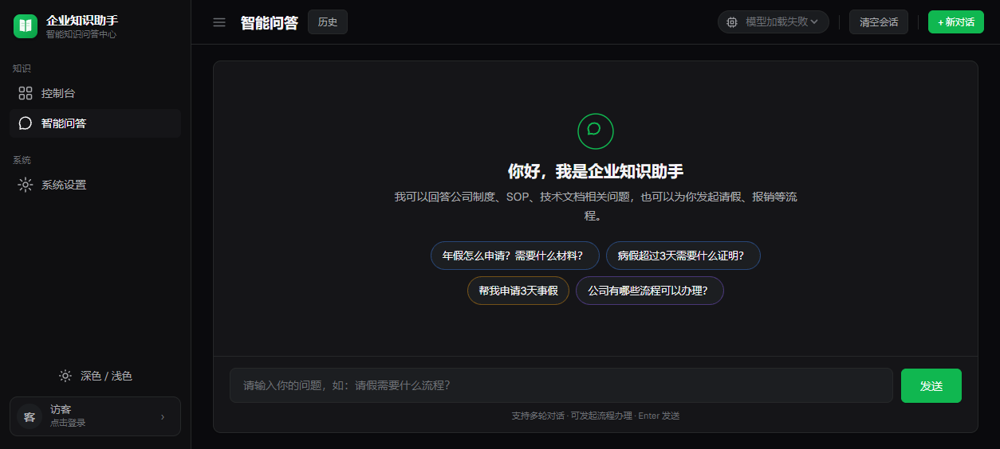
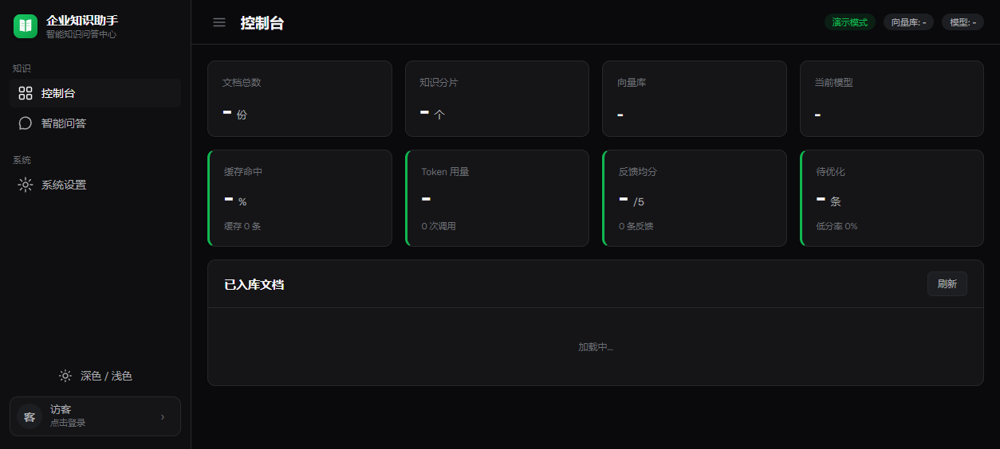

# 企业知识助手 2.0

将 SOP、技术文档转化为可查询的知识库，员工提问即可秒级获取标准答案。**2.0 升级为可观测、可评估、可扩展的多知识库 RAG 平台**：真实语义检索 + 可插拔重排序 + LLM Agent 工具闭环 + 长期记忆 + 真流式 + 认证权限 + Eval 评估体系。

## 界面预览

| 智能问答 | 控制台（可观测） |
|:---:|:---:|
|  |  |


> 📌 **架构设计**：见 [`docs/架构设计-2.0.md`](./docs/架构设计-2.0.md)。
> 📌 **项目讲解与底层框架**：见 [`docs/GitHub项目讲解与底层框架.md`](./docs/GitHub项目讲解与底层框架.md)。
> 📌 **更新日志**：各版本变更记录见 [`CHANGELOG.md`](./CHANGELOG.md)。
> 📌 **项目介绍**：见 [`docs/项目介绍-2.0.md`](./docs/项目介绍-2.0.md)。
> 📌 **项目总览**（项目大纲：背景/职责/架构/API/快速开始）：见 [`docs/README-项目总览.md`](./docs/README-项目总览.md)。
> 📌 **专业名词解释**（RAG/Agent/工程名词 + 项目落地位置）：见 [`docs/专业名词解释.md`](./docs/专业名词解释.md)。
> 📌 **后续优化手册**（P0/P1/P2 路线图与维护约定）：见 [`docs/后续优化手册.md`](./docs/后续优化手册.md)。

## 技术栈

| 层级 | 选型 |
|------|------|
| 编排框架 | LangChain v0.3+ / LangGraph（多节点工作流） |
| Web 服务 | FastAPI + 依赖注入容器 |
| 向量数据库 | ChromaDB（开发）→ Milvus（生产） |
| LLM | DeepSeek / Qwen / OpenAI 兼容接口 |
| Embedding | DashScope text-embedding-v3 |
| 重排序 | **可插拔**：Qwen-Rerank 在线 / BGE 本地 / Demo 兜底 |
| 记忆 | 短期会话记忆 + 长期向量记忆（全链路接通）+ LLM 指代消解 |
| 认证 | JWT + RBAC（可关闭） |
| 评估 | Eval 评估集 + LLM-as-judge |
| 文档处理 | PyMuPDF / python-docx + RecursiveCharacterTextSplitter |
| 部署 | Docker Compose |

## 目录结构

```
├── config/          # 配置管理（settings.py、.env）
├── data/
│   ├── docs/        # 待入库文档
│   ├── uploads/     # 上传临时目录
│   └── eval/        # Eval 评估集（JSON）
├── src/
│   ├── core/        # 依赖注入容器 + 端口抽象 + 可观测性（2.0）
│   ├── ingestion/   # 文档入库流水线（loader/splitter/embedder）
│   ├── retrieval/   # 检索模块（retriever/reranker/hybrid_search）
│   ├── memory/      # 会话记忆 + 长期向量记忆（接通链路）
│   ├── chains/      # RetrievalQA / ConversationalQA（指代消解）
│   ├── agent/       # LangGraph 多节点工作流 + 可插拔工具
│   ├── models/      # LLM / Embedding / Reranker 实例化
│   ├── auth/        # JWT 认证 + RBAC（2.0）
│   ├── kb/          # 多知识库管理（2.0）
│   ├── eval/        # Eval 评估体系（2.0）
│   ├── prompts/     # 提示词模板
│   └── utils/
├── serve/           # FastAPI 入口与路由
├── vector_db/       # ChromaDB 持久化
├── docs/            # 架构设计文档
└── tests/
```

## 快速开始

### 1. 创建虚拟环境并安装依赖

```bash
python -m venv venv
# Windows
venv\Scripts\activate
# macOS / Linux
source venv/bin/activate

pip install -r requirements.txt
```

### 2. 配置环境变量

```bash
cp .env.example .env
# 编辑 .env，填写 LLM_API_KEY 与 EMBEDDING_API_KEY
# 未配置 Key 时自动进入"演示模式"，使用本地规则引擎，链路可离线运行
# Key 无效/过期时同样自动降级（不再报错），修复后恢复真实调用
```

### 3. 启动服务

```bash
uvicorn serve.main:app --reload --port 8008
```

访问 http://localhost:8008/docs 查看 Swagger 接口文档。

### 4. 入库文档

将文档放入 `data/docs/`（支持 PDF / MD / TXT / DOCX），然后调用：

```
POST /api/knowledge/ingest
```

或通过文件上传接口：

```
POST /api/upload   (multipart, 字段名 file)
```

## API 概览

| 方法 | 路径 | 说明 |
|------|------|------|
| POST | /api/qa/ask | 单次语义问答（v1.5：查询改写 + 上下文压缩 + 热查询缓存） |
| POST | /api/qa/chat | 多轮对话（带记忆 + 长期记忆 + 指代消解 + 查询改写 + 上下文压缩） |
| POST | /api/qa/chat/stream | 多轮对话**真流式**（SSE，含查询改写 + 上下文压缩） |
| POST | /api/qa/agent | 智能体问答（LangGraph 规则意图分类 + 工具调用） |
| POST | /api/qa/agent/react | 智能体问答（**ReAct：LLM 自主工具调用**，可多轮组合；无 Key 自动回退规则 Agent） |
| POST | /api/qa/feedback | **v1.5**：提交回答评分反馈（低分自动标记待优化） |
| GET | /api/qa/feedback/list | **v1.5**：查询用户反馈记录与统计 |
| POST | /api/qa/feedback/{id}/resolve | **v1.5**：标记低分反馈已处理 |
| GET | /api/qa/stats | **v1.5**：系统运行统计（缓存命中率 + Token 用量 + 反馈统计） |
| POST | /api/qa/clear | 清空会话记忆 |
| POST | /api/upload | 上传文档并入知识库 |
| POST | /api/knowledge/ingest | 批量入库 docs 目录 |
| DELETE | /api/knowledge/{doc_id} | 删除文档 |
| GET | /api/knowledge/stats | 系统统计 |
| POST | /api/auth/register | 注册（支持部门 department/额外授权 extra_kbs） |
| POST | /api/auth/login | 登录获取 JWT |
| GET | /api/auth/me | 当前用户 |
| POST | /api/auth/{username}/update | 调部门/授权（仅 admin） |
| GET | /api/auth/users | 用户列表（仅 admin） |
| GET | /api/kb/list | 知识库列表（按用户权限过滤） |
| POST | /api/kb/create | 创建知识库（可指定部门，仅 admin） |
| POST | /api/kb/{kb_id}/departments | 设置库可访问部门（仅 admin） |
| DELETE | /api/kb/{kb_id} | 删除知识库（仅 admin） |
| POST | /api/eval/run | 运行 Eval 评估（仅 admin） |

## 知识库权限隔离（角色 + 部门 + 用户覆盖）

问答接口（`/api/qa/*`）支持 `kb_id` 参数，配合知识库权限模型实现「不同角色/部门只能访问对应知识库」：

- **admin 角色** → 可访问所有知识库
- **user 角色** → 可访问本部门被授权的知识库（知识库可设置 `departments` 白名单）+ 公开库（departments 为空）+ 个人额外授权 `extra_kbs`
- **调部门**：admin 通过 `POST /api/auth/{username}/update` 修改用户 `department`，即可切换其默认可访问的知识库；也可单独调整 `extra_kbs` 做个性化覆盖

> 认证默认 `AUTH_ENABLED=false`（匿名演示）；设为 `true` 并配置 `JWT_SECRET` 后启用完整权限隔离。

## Eval 评估

```bash
# 仅检索指标
python -m src.eval.run
# 含 LLM-as-judge 打分
python -m src.eval.run --judge
# 指定知识库 / 输出 JSON
python -m src.eval.run --kb hr --json
```

## 生产部署（Milvus）

1. 在 `docker-compose.yml` 中启用 milvus 服务。
2. 设置 `.env`：`VECTOR_STORE=milvus`、`MILVUS_URI=http://localhost:19530`。
3. 安装 `langchain-milvus` 并重启。

## 核心流程

**文档入库**：`PDF/Word(含表格) → 加载解析(表格转Markdown) → 智能切片 → Embedding → 向量库 Upsert（按 doc_id 增量更新）→ 清空查询缓存`

**问答链路（v1.5）**：`提问 → 热查询缓存检查 → 查询改写(LLM/规则) → 指代消解 → Dense + Sparse 混合检索 → RRF 融合 → BGE-Reranker 精排 → 上下文压缩(Token预算) → LLM 生成带来源回答 → 写入缓存 → 记录Token用量`

**ReAct Agent 链路**（`/api/qa/agent/react`）：`LLM 自主决策（bind_tools）⇄ 工具执行（知识检索 / 发起流程 / 流程列表）→ 最终回答`。由 LLM 每轮自主判断「直接回答还是调用工具」，支持多轮、多工具组合；未配置真实 LLM 时自动回退规则 Agent（离线可用）。实现在 `src/agent/react_agent.py`。

## v1.5 新增优化

| 模块 | 文件 | 说明 |
|------|------|------|
| 查询改写 | `src/retrieval/query_rewriter.py` | LLM/规则改写口语化问题，补充同义词，提升召回率 |
| 上下文压缩 | `src/chains/context_compressor.py` | Token 超预算时对分片摘要/截断，降低 60% Token 消耗 |
| 热查询缓存 | `src/retrieval/cache.py` | LRU 缓存高频问题，TTL 1h，文档变更自动失效 |
| DOCX 表格提取 | `src/ingestion/loader.py` | Word 表格转为 Markdown 入库，避免信息丢失 |
| Token 监控 | `src/core/token_tracker.py` | 跟踪 LLM Token 消耗，超阈值告警，按模型统计 |
| 用户反馈 | `src/eval/feedback.py` | 1-5 分评分，低分自动标记待优化，JSONL 持久化 |
| 系统统计 | `GET /api/qa/stats` | 缓存命中率 + Token 用量 + 反馈统计一体化 |

## 测试

```bash
pytest tests/
```
